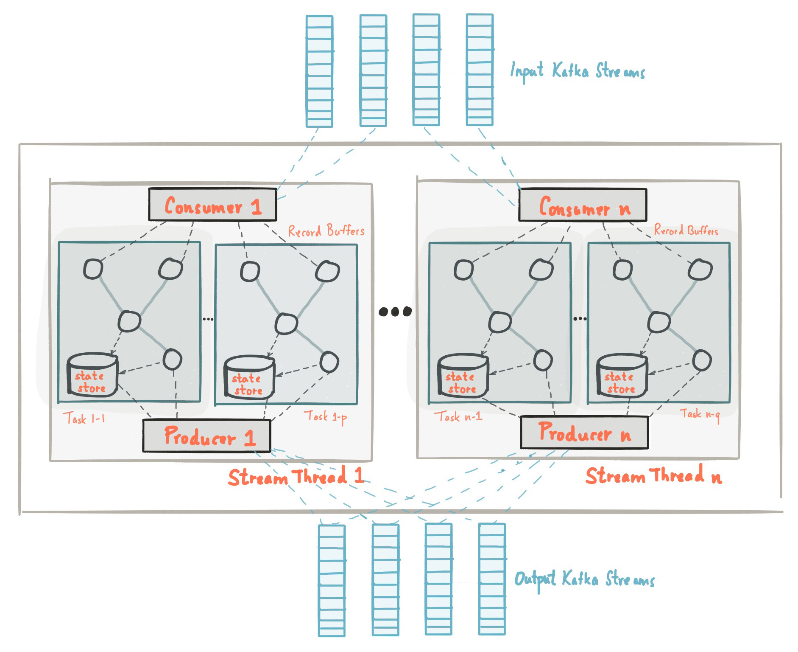
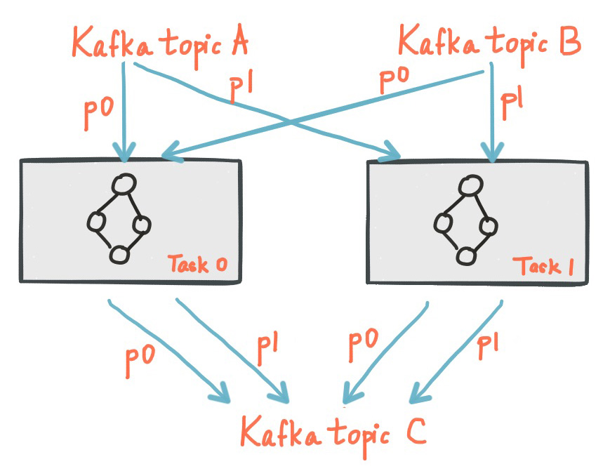
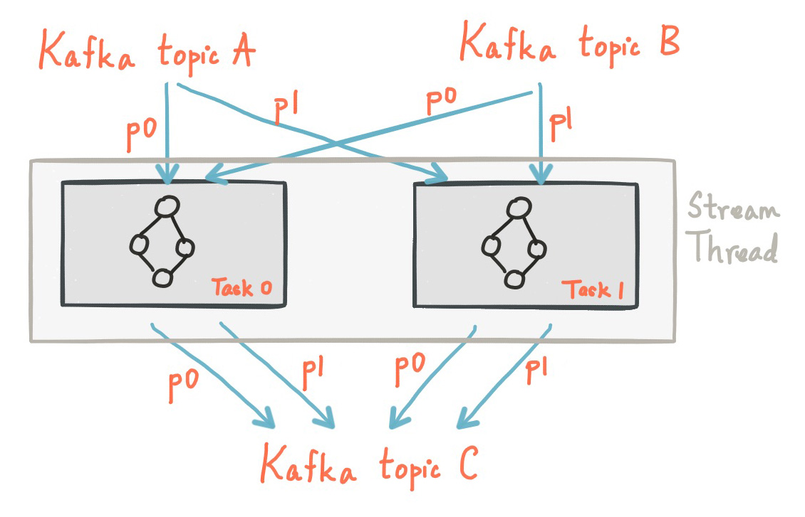
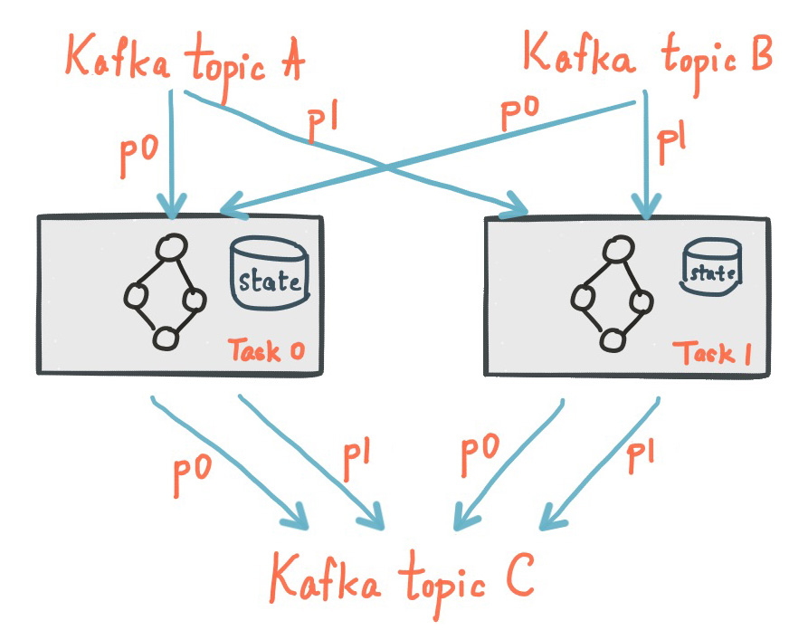

# Kafka Streams Architecture

Kafka Streams 이 어떻게 작동하는지, Kafka Streams Architecture 에 대한 설명입니다.
 

Kafka Streams Docs 를 참고하면서 작성하였습니다.   
<a href="https://kafka.apache.org/33/documentation/streams/">Kafka Streams Docs</a>
 
 
 
 

## Architecture
Kafka Streams 은 Kafka 생산자 및 소비자 라이브러리를 기반으로 구축하고 Kafka 의 기본 기능을 활용하여 데이터 병렬화, 분산 조정, 내결함성 및 운영 단순성을 제공하여 애플리케이션 개발을 단순화합니다.   
아래 그림은 Kafka Streams 라이브러리를 사용하는 응용 프로그램의 구조입니다.   
 
 

    

 
 

## 스트림 파티션과 작업
Kafka 의 메시징 계층은 데이터를 저장하고 전송하기 위해 데이터를 분할합니다.   
Kafka Streams 은 데이터를 처리하기 위해 데이터를 분할합니다.   
두 경우 모두 이러한 파티셔닝을 통해 데이터 인접성, 탄력성, 확장성, 고성능 및 내결함성을 실현할 수 있습니다.   
Kafka Streams 은 카프카 토픽 파티션을 기반으로 하는 병렬 모델의 논리 단위로 파티션과 작업의 개념을 사용합니다.   
Kafka Streams 와 Kafka 사이에는 병렬의 맥락에서 밀접한 관련이 있습니다.   
 

- 각 스트림 파티션은 데이터 레코드의 순서이며 Kafka 토픽 파티션에 매핑됩니다.
- 스트림의 데이터 레코드는 해당 항목의 Kafka 메시지에 매핑됩니다.
- 데이터 레코드의 키는 Kafka 와 Kafka 스트림 모두에서 데이터의 파티셔닝, 즉 데이터가 토픽 내의 특정 파티션으로 라우팅되는 방식을 결정합니다.
 

응용 프로그램의 프로세서 토폴로지는 여러 작업으로 나누어 확장됩니다.   
보다 구체적으로, Kafka Streams 은 응용 프로그램의 입력 스트림 파티션을 기반으로 고정된 수의 작업을 생성하며, 각 작업에는 입력 스트림의 파티션 목록(ex: Kafka 토픽)이 할당됩니다.   
작업에 파티션을 할당하는 작업은 변경되지 않으므로 각 작업은 응용 프로그램의 고정 병렬 처리 단위가 됩니다.   
그런 다음 할당된 파티션을 기반으로 자체 프로세서 토폴로지를 인스턴스화할 수 있습니다.   
또한 할당된 각 파티션에 대한 버퍼를 유지 관리하고 이러한 레코드 버퍼에서 메시지를 한 번에 한 번에 처리합니다.   
결과적으로 스트림 작업은 수동 개입 없이 독립적으로 병렬로 처리할 수 있습니다.
 

약간 단순화하면, 애플리케이션이 실행할 수 있는 최대 병렬 처리는 최대 스트림 작업 수로 제한되며, 이 자체는 애플리케이션이 읽는 입력 항목의 최대 파티션 수에 의해 결정됩니다.   
예를 들어 입력 주제에 5개의 파티션이 있는 경우 최대 5개의 애플리케이션 인스턴스를 실행할 수 있습니다.   
이러한 인스턴스는 토픽의 데이터를 공동으로 처리합니다.   
입력 토픽의 파티션보다 더 많은 수의 앱 인스턴스를 실행하는 경우 "초과" 앱 인스턴스가 실행되지만 유휴 상태로 유지됩니다.    
그러나 사용 중인 인스턴스 중 하나가 다운되면 유휴 인스턴스 중 하나가 전자의 작업을 재개합니다.   
 

Kafka Streams 는 리소스 관리자가 아니라 스트림 처리 애플리케이션이 실행되는 모든 곳에서 **실행**하는 라이브러리라는 점을 이해하는 것이 중요합니다.   
응용 프로그램의 여러 인스턴스는 동일한 시스템에서 실행되거나 여러 시스템에 분산되며 작업은 라이브러리를 통해 실행 중인 응용 프로그램 인스턴스에 자동으로 배포될 수 있습니다.   
작업에 대한 파티션 할당은 절대 변경되지 않습니다.   
애플리케이션 인스턴스가 실패하면 할당된 모든 작업이 다른 인스턴스에서 자동으로 다시 시작되고 동일한 스트림 파티션에서 계속 소비됩니다.   
 

>※ NOTE   
>토픽 파티션은 작업에 할당되고 작업은 상태 저장 작업의 로드 밸런싱 및 고정성을 절충하기 위한 최선의 노력으로 모든 인스턴스의 모든 스레드에 할당됩니다.   
> 이 할당의 경우 Kafka Streams 는 `StreamsPartitionAssignor` 클래스를 사용하며 다른 할당자로 변경할 수 없습니다.   
> 다른 지정자를 사용하려고 하면 Kafka Streams 가 이를 무시합니다.   

  

다음 그림은 입력 스트림의 한 파티션에 각각 할당된 두 개의 작업을 보여줍니다.
 
 

    

 
 
 
 

## 스레딩 모델
Kafka Streams 을 사용 하면 라이브러리가 애플리케이션 인스턴스 내에서 처리를 병렬화하는 데 사용할 수 있는 스레드 수를 구성할 수 있습니다.   
각 스레드는 프로세서 토폴로지로 독립적인 하나 이상의 작업을 실행할 수 있습니다.   
다음 그림은 두 개의 스트림 작업을 실행하는 하나의 스트림 스레드를 보여줍니다.   
 
 

    

 
 

애플리케이션의 더 많은 스트림 스레드 또는 더 많은 인스턴스를 시작하는 것은 단지 토폴로지를 복제하고 Kafka 파티션의 다른 하위 집합을 처리하도록 하여 처리를 효과적으로 병렬화하는 것입니다.   
스레드 간에 공유 상태가 없으므로 스레드 간 조정이 필요하지 않습니다.   
따라서 애플리케이션 인스턴스와 스레드에서 토폴로지를 병렬로 실행하는 것이 매우 간단해집니다.   
다양한 스트림 스레드 간에 Kafka 토픽 파티션 할당은 Kafka 의 조정 기능을 활용하는 Kafka Streams 에 의해 투명하게 처리됩니다.   
 

위에서 설명한 것처럼 Kafka Streams 을 사용하여 스트림 처리 애플리케이션을 확장하는 것은 쉽습니다.   
애플리케이션의 추가 인스턴스를 시작하기만 하면 Kafka Streams 이 애플리케이션 인스턴스에서 실행되는 각 작업에 파티션을 배포합니다.   
애플리케이션의 실행 중인 모든 인스턴스에서 모든 스레드(또는 스레드가 실행하는 작업)가 처리할 입력 파티션이 하나 이상 있도록 입력 Kafka 토픽 파티션 수만큼 애플리케이션의 스레드를 시작할 수 있습니다.   
 

Kafka 2.8부터는 Kafka Stream 클라이언트를 확장할 수 있는 것과 같은 방식으로 스트림 스레드를 확장할 수 있습니다.    
스트림 스레드를 추가하거나 제거하기만 하면 Kafka Streams 이 파티션 재배포를 처리합니다.    
실행 중인 스레드 수를 복구하기 위해 클라이언트를 다시 시작할 필요가 없도록 죽은 스트림 스레드를 대체하기 위해 스레드를 추가할 수도 있습니다.   
 
 
 
 

## 로컬 상태 저장소(Local State Stores)
Kafka Streams 은 스트림 처리 애플리케이션에서 상태 저장 작업을 구현할 때 중요한 기능인 데이터를 저장하고 쿼리하는 데 사용할 수 있는 소위 상태 저장소 를 제공합니다.   
예를 들어 Kafka Streams DSL 은 `join()`또는 `aggregate()`와 같은 상태 저장 연산자를 호출하거나 스트림을 Windowing 할 때 이러한 상태 저장소를 자동으로 생성하고 관리합니다.   
 

Kafka Streams 애플리케이션의 모든 스트림 작업은 처리에 필요한 데이터를 저장하고 쿼리하기 위해 AP I를 통해 액세스할 수 있는 하나 이상의 로컬 상태 저장소를 포함할 수 있습니다.   
Kafka Streams 은 이러한 로컬 상태 저장소에 대한 내결함성 및 자동 복구를 제공합니다.   
 

다음 그림은 전용 로컬 상태 저장소가 있는 두 개의 스트림 작업을 보여줍니다.
 
 

    

 
 
 
 

## 내결함성(Fault Tolerance)
Kafka Streams 은 Kafka 내에 기본적으로 통합된 내결함성 기능을 기반으로 합니다.   
Kafka 파티션은 가용성이 높고 복제됩니다.   
따라서 스트림 데이터가 Kafka 에 유지되면 애플리케이션이 실패하여 다시 처리해야 하는 경우에도 사용할 수 있습니다.   
Kafka Streams 의 작업은 Kafka 소비자 클라이언트가 제공하는 내결함성 기능을 활용하여 오류를 처리합니다.   
작업이 실패한 시스템에서 실행되는 경우 Kafka Streams 은 애플리케이션의 나머지 실행 인스턴스 중 하나에서 작업을 자동으로 다시 시작합니다.
 

또한 Kafka Streams 은 로컬 상태 저장소가 오류에도 강하다는 것을 확인합니다.   
각 상태 저장소에 대해 상태 업데이트를 추적하는 복제된 변경 로그 Kafka 항목을 유지 관리합니다.   
이러한 변경 로그 항목도 분할되어 각 로컬 상태 저장소 인스턴스와 저장소에 액세스하는 작업에 자체 전용 변경 로그 항목 파티션이 있습니다.   
로그 압축 토픽이 무한정 커지는 것을 방지하기 위해 이전 데이터를 안전하게 제거할 수 있도록 변경 로그 토픽에서 활성화됩니다.   
작업이 실패한 시스템에서 실행되고 다른 시스템에서 다시 시작되는 경우 Kafka Streams 은 새로 시작된 작업에 대한 처리를 재개하기 전에 해당 변경 로그 항목을 재생하여 관련 상태 저장소를 실패 이전의 콘텐츠로 복원하도록 보장합니다.   
결과적으로 장애 처리는 최종 사용자에게 완전히 투명합니다.

작업 (재)초기화 비용은 일반적으로 상태 저장소의 관련 변경 로그 항목을 재생하여 상태를 복원하는 시간에 따라 주로 달라집니다.   
이 복원 시간을 최소화하기 위해 사용자는 로컬 상태의 대기 복제본 (즉, 상태의 완전히 복제된 복사본) 을 갖도록 애플리케이션을 구성할 수 있습니다.   
작업 마이그레이션이 발생하면 Kafka Streams 은 작업 (재)초기화 비용을 최소화하기 위해 대기 복제본이 이미 존재하는 애플리케이션 인스턴스에 작업을 할당합니다.   
Kafka Streams 구성 섹션에서 `num.standby.replicas`을 확인하세요.   
2.6부터 Kafka Streams는 해당 인스턴스가 존재하는 경우 해당 인스턴스에만 작업이 할당되도록 보장합니다.   
대기 작업은 오류 발생 시 포착된 인스턴스가 존재할 가능성을 높입니다.

랙 인식 기능으로 대기 복제본을 구성할 수도 있습니다.   
구성된 경우 Kafka Streams 대기 작업을 활성 작업과 다른 "랙"에 배포하려고 하므로 활성 작업의 랙에 장애가 발생했을 때 복구 시간이 더 빠릅니다.   
Kafka Streams Developer Guide 섹션에서 `rack.aware.assignment.tags`를 참조하십시오.