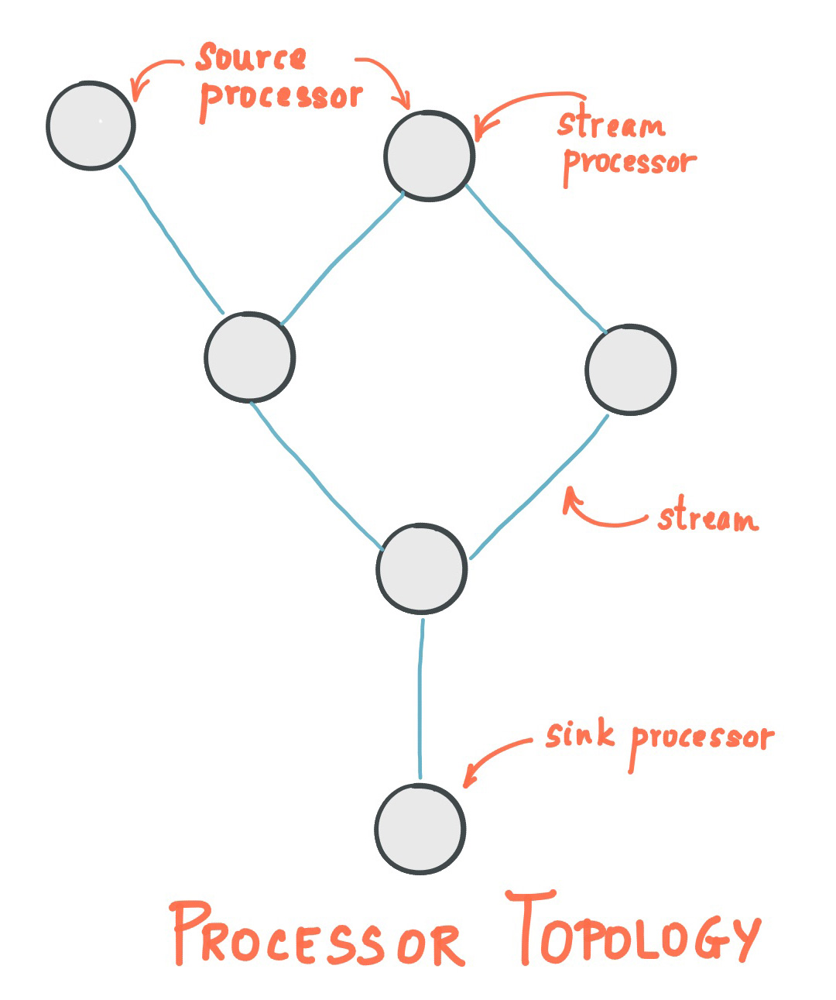
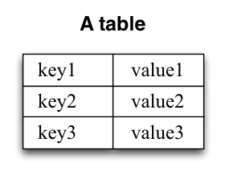
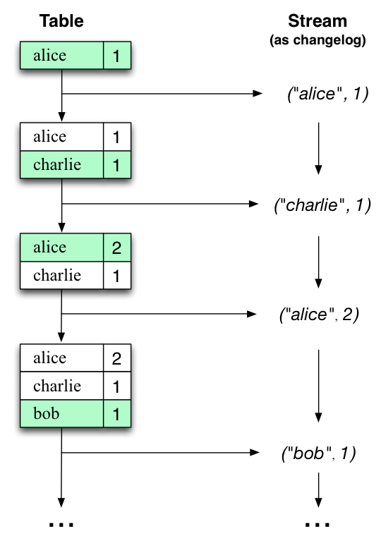
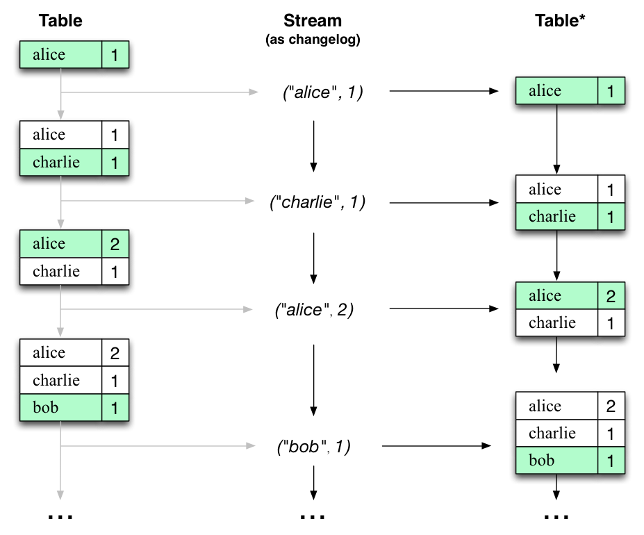

# Kafka Streams API

Kafka Streams API 에 대한 설명입니다.   
 

Kafka Streams Docs 를 참고하면서 작성하였습니다.   
<a href="https://kafka.apache.org/33/documentation/streams/">Kafka Streams Docs</a>

## Kafka Streams 란?
**Kafka Streams** 는 Kafka 에 저장된 데이터를 처리하고 분석하기 위한 클라이언트 라이브러리입니다.   
이벤트 시간과 처리 시간 간의 적절한 구분, 윈도우 지원, 간단하면서도 효율적인 관리 및 응용 프로그램 상태의 실시간 쿼리와 같은 중요한 스트림 처리 개념을 기반으로 합니다.   
 

**Kafka Streams** 는 진입 장벽이 낮습니다.   
단일 시스템에서 빠르게 작성하고 실행할 수 있습니다.   
대량 프로덕션 워크로드로 확장하려면 여러 머신에서 애플리케이션의 추가 인스턴스만 실행하면 됩니다.   
Kafka Streams 는 Kafka 의 병렬 처리 모델을 활용하여 동일한 애플리케이션의 여러 인스턴스에 대한 로드 밸런싱을 투명하게 처리합니다.   
 
 
 
 

## Kafka Streams 특징
- 단순하고 가벼운 클라이언트 라이브러리로 설계되어 모든 Java 애플리케이션에 쉽게 사용가능하고,   
사용자가 스트리밍 애플리케이션에 대해 가지고 있는 기존 패키징, 배포 및 운영 도구와 통합될 수 있습니다.   
 

- 내부 메시징 계층으로 Apache Kafka 자체 이외의 시스템에 대한 외부 종속성이 없습니다.   
특히 Kafka 의 파티셔닝 모델을 사용하여 강력한 순서 보장을 유지하면서 처리를 수평으로 확장합니다.   
 

- `windowed join` 및 `aggregation`와 같은 매우 빠르고 효율적인 상태 저장 작업을 가능하게 하는 내결함성 로컬 상태를 지원합니다.   
 

- 처리 중에 Streams 클라이언트 또는 Kafka 브로커에 오류가 발생하는 경우에도   
각 레코드가 한 번만 처리되도록 정확히 한 번만 처리하는 체계를 지원합니다.   
 

- 한 번에 하나의 레코드 처리를 사용하여 밀리 초 처리 대기 시간을 달성하고   
레코드 도착 순서가 잘못된 `event-time based windowing` 작업을 지원합니다.   
 

- 높은 수준의 `Streams DSL` 및 낮은 수준의 프로세서 API 와 함께 필요한 스트림 처리 기본 요소를 제공합니다.   
 
 
 
 

## 스트림 프로세싱 토폴로지(Stream Processing Topology)
스트림 프로세싱 애플리케이션은 Kafka Streams 라이브러리를 사용하는 모든 프로그램으로, 하나 이상의 **프로세서 토폴로지**를 통해 로직을 정의합니다.   
여기서 **프로세서 토폴로지**란 **스트림**으로 연결된 **스트림 프로세서**의 그래프입니다.   
 
 

### 스트림(Stream)
**스트림**은 Kafka Streams 에서 제공하는 가장 중요한 추상화로, 무한하고 지속적으로 업데이트되는 데이터 세트를 의미합니다.   
이는 키-값 쌍으로 정의되는 데이터 레코드로, 정렬과 재생 가능한 불변 상태의 내결함성 시퀀스입니다.   
 

### 스트림 프로세서(Stream Processor)
**스트림 프로세서**는 프로세서 토폴로지의 **노드**입니다.   
이는 토폴로지의 업스트림 프로세서에서 한 번에 하나의 입력 레코드를 수신하고 작업을 적용하여, 스트림의 데이터를 변환하는 처리 단계를 나타내며 이후에 다운스트림 프로세서에 하나 이상의 출력 레코드를 생성할 수 있습니다.   
 

토폴로지에는 두 개의 특수 프로세서가 있습니다.   
- **소스 프로세서(Source Processor)**   
  - 업스트림 프로세서가 없는 특수한 유형의 스트림 프로세서입니다.   
  - 토픽의 레코드를 소비하고 다운스트림 프로세서로 전달하여, 하나 이상의 Kafka 토픽에서 해당 토폴로지에 대한 입력 스트림을 생성합니다.   
 

- **싱크 프로세서(Source Processor)**   
  - 다운스트림 프로세서가 없는 특수 유형의 스트림 프로세서입니다.   
  - 업스트림 프로세서에서 수신된 레코드를 지정된 Kafka 토픽으로 보냅니다.
 
 

    

 
 

일반 프로세서 노드에서는 현재 레코드를 처리하는 동안 다른 원격 시스템에도 액세스할 수 있습니다.   
따라서 처리된 결과는 Kafka 로 다시 스트리밍되거나 외부 시스템에 기록될 수 있습니다.   
 

Kafka Streams 는 스트림 처리 토폴로지를 정의하는 두 가지 방법을 제공합니다.   
- Kafka Streams DSL
  - 상위 수준 프로세서 API 로, `map`, `filter`, `join`, `aggregation` 같은 가장 일반적인 데이터 변환 작업을 제공합니다.   
 

- 하위 수준 프로세서 API
  - 맞춤형 프로세서를 정의 및 연결하고 상태 저장소와 상호 작용할 수 있습니다.
 
 

프로세서 토폴로지는 스트림 처리 코드에 대한 논리적 추상화일 뿐입니다.   
런타임 시 논리 토폴로지는 인스턴스화되고 병렬 처리를 위해 응용 프로그램 내에서 복제됩니다.   
 
 
 
 

## 시간(Time)
스트림 처리의 중요한 측면은 **시간** 개념 과 이를 모델링하고 통합하는 방법입니다.   
예를 들어 Windowing 과 같은 일부 작업은 시간 경계를 기반으로 정의됩니다.
 

스트림의 일반적인 시간 개념은 다음과 같습니다.

- **이벤트 시간(Event Time)**
  - 이벤트 또는 데이터 레코드가 발생한 시점, 즉 원래 소스에서 생성된 시점입니다.   
 

- **처리 시간(Processing Time)**
  - 이벤트 또는 데이터 레코드가 스트림 처리 애플리케이션에 의해 처리되는 시점, 즉 레코드가 소비되는 시점입니다.   
 

- **수집 시간(Ingestion time)**
  - 이벤트 또는 데이터 레코드가 Kafka 브로커에 의해 토픽 파티션에 저장되는 시점입니다.   
 

이벤트 시간과 수집 시간 사이의 선택은 실제로 Kafka(Kafka Streams 가 아님) 구성을 통해 수행됩니다.   
- Kafka 0.10.x 부터는 타임스탬프가 자동으로 Kafka 메시지에 포함됩니다.

각 Kafka 구성 설정은 브로커 수준 또는 토픽별로 지정할 수 있습니다.   
Kafka 의 구성에 따라 이러한 타임스탬프는 이벤트 시간 또는 수집 시간을 나타냅니다.   
Kafka Streams 의 기본 `TimestampExtractor`는 이러한 타임스탬프를 있는 그대로 검색합니다.   
따라서 애플리케이션의 유효 시간 의미는 Kafka 구성에 따라 달라집니다.   
 

Kafka Streams 는 `TimestampExtractor` 인터페이스를 통해, 모든 데이터 레코드에 타임스탬프를 할당합니다.   
 

이러한 레코드별 타임스탬프는 시간과 관련하여 스트림의 진행 상황을 설명하고, Windowing 과 같은 시간에 의존적인 작업에 의해 활용됩니다.   
 

결과적으로 이 시간은 새 레코드가 프로세서에 도착할 때만 진행됩니다.   
애플리케이션이 실제로 실행되는 시간과 구별하기위해, 이 데이터 기반 시간을 애플리케이션의 **스트림 시간** 이라고 부릅니다.   
 

`TimestampExtractor` 인터페이스의 구현체는 스트림 시간 정의에 다른 의미를 제공합니다.   
예를 들어 포함된 타임스탬프 필드와 같은 데이터 레코드의 실제 콘텐츠를 기반으로, 타임스탬프를 검색하거나 계산하여 이벤트 시간의 의미 체계를 제공하고, 현재 시간을 반환하여 처리 시간의 의미 체계를 스트림 시간으로 계산합니다.   
 

따라서 개발자는 비즈니스 요구 사항에 따라 다양한 시간 개념을 적용할 수 있습니다.   
 

마지막으로, Kafka Streams 응용 프로그램이 Kafka 에 레코드를 쓸 때마다, 새로운 레코드에 타임스탬프를 할당합니다.   
타임스탬프가 할당되는 방법은 컨텍스트에 따라 다릅니다:

- `process()` 함수 호출에서 트리거된 `context.forward()`와 같은 일부 입력 레코드를 처리하여 새 출력 레코드가 생성되면, 출력 레코드 타임스탬프가 입력 레코드 타임스탬프에서 직접 상속됩니다.   
 

- `Punctuator#punctuate()`과 같은 주기적 기능을 통해 새로운 출력 레코드가 생성되는 경우, 출력 레코드 타임스탬프는 스트림 작업의 현재 내부 시간(`context.timestamp()`를 통해 얻은 시간)으로 정의됩니다.   
 

- `aggregation`의 경우, 결과 업데이트 레코드의 타임스탬프는 결과에 기여하는 모든 입력 레코드의 최대 타임스탬프입니다.   
 

`#forward()`를 호출할 때 출력 레코드에 타임스탬프를 명시적으로 할당하여 프로세서 API 의 기본 동작을 변경할 수 있습니다.   
 
 

`aggregation` 및 `join`의 경우 다음 규칙을 사용하여 타임스탬프를 계산합니다.   

- 왼쪽 및 오른쪽 입력 레코드가 있는 `join`(stream-stream, table-table)의 경우, 출력 레코드의 타임스탬프는 `max(left.ts, right.ts)`로 할당됩니다.   
 

- 스트림 테이블 `join`의 경우, 출력 레코드에 스트림 레코드의 타임스탬프가 할당됩니다.   
 

- `aggregation`의 경우, Kafka Streams 는 전체적으로(`window`가 아닌 경우) 또는 `window`별로 모든 레코드에 대한 최대 타임스탬프를 계산합니다.   
 

- 상태 비저장 작업의 경우 입력 레코드 타임스탬프가 전달됩니다.   
여러 레코드를 내보내는 `flatMap` 및 `siblings`의 경우 모든 출력 레코드가 해당 입력 레코드에서 타임스탬프를 상속합니다.
 
 
 
 

## 스트림(Stream)과 테이블(Table)의 이중성
실제로 스트림 처리 사용 사례를 구현할 때 일반적으로 스트림과 데이터베이스가 모두 필요합니다.   
실제로 일반적인 사례는 데이터베이스 테이블의 최신 고객 정보로 고객 거래의 유입 스트림이 많은 전자 상거래 응용 프로그램입니다.   
즉, 스트림은 어디에나 있지만 데이터베이스도 어디에나 있습니다.   
 

따라서 모든 스트림 처리 기술은 스트림 및 테이블에 대한 최고 수준의 지원을 제공해야 합니다.   
Kafka Streams API 는 스트림과 테이블에 대한 핵심 추상화를 통해 이러한 기능을 제공합니다.   
 
스트림과 테이블 사이에 이중성이라는 밀접한 관계가 있습니다.   
또한 Kafka 는 이러한 이중성을 다양한 방식으로 활용합니다.   
예를 들어, 애플리케이션을 탄력적으로 만들고, 무장애 상태의 상태 저장 처리를 지원하거나, 애플리케이션의 최신 처리 결과에 대해 대화형 쿼리를 실행합니다.   
그리고 Kafka Streams API 는 내부 용도 외에도 개발자들이 자체 애플리케이션에서 이러한 이중성을 활용할 수 있도록 합니다.   
 

Kafka Streams 의 `aggregation`와 같은 개념을 말하기 전에 먼저 언급한 스트림 테이블 이중성에 이해해야 합니다.   
본질적으로 이러한 이중성은 스트림을 테이블로 볼 수 있고 테이블을 스트림으로 볼 수 있다는 것을 의미합니다.   
예를 들어 Kafka 의 Log Compaction(로그 압축) 은 이러한 이중성을 이용합니다.   
 

이중성에 대해 표로 설명합니다.   
 

표의 단순한 형태는 key-value 의 집합이며, `map` 또는 `associative array`이라고도 합니다.   
이러한 표는 다음과 같이 볼 수 있습니다.   
 
 

    

 
 

스트림 테이블 이중성은 스트림과 테이블 사이의 밀접한 관계를 설명합니다.   
 

- **스트림 to 테이블**
  - 스트림은 테이블의 변경 로그로 간주될 수 있으며, 스트림의 각 데이터 레코드는 테이블의 상태 변경을 캡처합니다.   
  따라서 스트림은 위장된 테이블이며, 테이블을 재구성하기 위해 처음부터 끝까지 변경 로그를 재생함으로써 쉽게 실제 테이블로 변환될 수 있습니다.   
 

- **테이블 to 스트림**
  - 테이블은 특정 시점에서 스트림의 각 key 에 대한 최신 값의 스냅샷으로 간주될 수 있습니다(스트림의 데이터 레코드는 key-value 입니다).   
  따라서 테이블은 위장된 스트림이며 테이블의 각 key-value 항목을 반복함으로써 실제 스트림으로 쉽게 변환될 수 있습니다.
 

예를 들어 사용자별 총 페이지 뷰 수를 추적하는 표가 있습니다.   
시간이 지남에 따라 새 페이지 뷰 이벤트가 처리될 때마다 테이블의 상태가 그에 따라 업데이트됩니다.   
여기서 서로 다른 시점 간의 상태 변화는 변경 로그 스트림으로 나타낼 수 있습니다.
 
 

    

 
 

그리고 스트림 테이블 이중성 때문에 동일한 스트림을 사용하여 원래 테이블을 재구성할 수 있습니다.   
 
 

    

 
 

예를 들어, 동일한 메커니즘이 CDC(Change Data Capture, 변경된 데이터 캡처)를 통해 데이터베이스를 복제하고 Kafka Streams 내에서 내결함성을 위해 시스템 간에 상태 저장소를 복제하는 데 사용됩니다.   
스트림 테이블 이중성은 Kafka Streams 가 KStream, KTable 및 Global KTable 인터페이스를 통해 명시적으로 모델링할 정도로 중요한 개념입니다.   
 
 
 
 

## Aggregations
`aggregation`(집계) 작업은 하나의 입력 스트림 또는 테이블을 사용하며, 여러 입력 레코드를 하나의 출력 레코드로 결합하여 새로운 테이블을 생성합니다.   
`aggregation` 의 사례는 계산 카운트 또는 합계가 있습니다.   

Kafka Streams DSL 에서 `aggregation` 의 입력 스트림은 KStream 이나 KTable 이 될 수 있지만, 출력 스트림은 항상 KTable 이 될 것입니다.   
이를 통해 Kafka Streams 은 값이 생성되고 방출된 후 추가 레코드의 순서가 잘못 도착하였을 때, `aggregation` 값을 업데이트할 수 있습니다.   
이와 같이 순서에 맞지 않는 도착이 발생하면, `aggregation` 된 KStream 이나 KTable 은 새로운 `aggregation` 값을 내보냅니다.   
출력은 KTable 이므로 이후 처리 단계에서는 새 값이 이전 값을 동일한 키에 덮어쓰는 것으로 간주됩니다.   
 
 

## Windowing
Windowing 을 사용하면 `aggregation` 또는 `join` 과 같은 상태 저장 작업에 대해 동일한 키를 가진 레코드를 `window`로 그룹화하는 방법을 제어할 수 있습니다.   
`window`는 레코드 키별로 추적됩니다.   
 

Windowing 작업은 Kafka Streams DSL 에서 사용할 수 있습니다.   
Windowing 작업 시 `window`에 대한 유예 기간을 지정할 수 있습니다.   
이 유예 기간은 Kafka Streams 가 지정된 `window`에 대해 순서가 잘못된 데이터 레코드를 기다리는 시간을 제어합니다.   
`window`의 유예 기간이 지난 후에 레코드가 도착하면 레코드는 삭제되고 해당 `window`에서 처리되지 않습니다.   
구체적으로, 레코드의 타임스탬프가 레코드가 `window`에 속한다고 지시하는 경우 레코드는 폐기되지만 현재 스트림 시간이 `window` 끝에 유예 기간을 더한 값보다 큽니다.
 

순서가 잘못된 레코드는 항상 실제 환경에서 발생할 수 있으며 응용 프로그램에서 적절하게 설명되어야 합니다.   
순서가 잘못된 레코드가 처리되는 방법은 유효한 시간 의미론에 따라 달라집니다.   
처리 시간의 경우, 의미론은 "기록이 처리되고 있을 때" 입니다.   
따라서 순서가 잘못된 레코드는 이벤트 시간에만 해당되는 것으로 간주할 수 있습니다.   
두 경우 모두 Kafka Streams 은 순서가 잘못된 레코드를 적절하게 처리할 수 있습니다.   
 
 

## States
일부 스트림 처리 응용 프로그램은 상태를 요구하지 않습니다.   
즉, 메시지 처리는 다른 모든 메시지 처리와 독립적입니다.   
그러나 상태를 유지할 수 있게 되면 입력 스트림에 참여하거나 데이터 레코드를 그룹화하고 `aggregation` 할 수 있는 등 정교한 스트림 처리 애플리케이션의 많은 가능성이 열립니다.   
이러한 많은 상태 저장 연산자들은 Kafka Streams DSL 에 의해 제공됩니다.   
 

Kafka Streams 은 스트림 처리 응용 프로그램이 데이터를 저장하고 쿼리하기 위해 사용할 수 있는 상태 저장소를 제공합니다.   
이 기능은 상태 저장 작업을 구현할 때 중요한 기능입니다.   
Kafka Streams 의 모든 작업은 처리에 필요한 데이터를 저장하고 쿼리하기 위해 API 를 이용하여 액세스할 수 있는 하나 이상의 상태 저장소를 포함합니다.   
이러한 상태 저장소는 영구 키 값 저장소, 메모리 내 해시 맵 또는 다른 편리한 데이터 구조일 수 있습니다.   
Kafka Streams 는 로컬 상태 저장소에 대해 내결함성 및 자동 복구 기능을 제공합니다.
 

Kafka Streams 은 상태 저장소를 만든 스트림 처리 응용 프로그램 외부의 메서드, 스레드, 프로세스 또는 응용 프로그램에 의한 상태 저장소의 직접 읽기 전용 쿼리를 허용합니다.   
이 기능은 대화형 쿼리라는 기능을 통해 제공됩니다.   
모든 저장소의 이름이 지정되고 대화형 쿼리는 기본 구현의 읽기 작업만 표시합니다.
 
 

## PROCESSING GUARANTEES(처리 보장)
스트림 처리에서 가장 많이 묻는 질문 중 하나는 "내 스트림 처리 시스템은 처리 중에 일부 오류가 발생하더라도 각 레코드가 한 번만 처리된다는 것을 보장하는가?"입니다.   
정확하게 한 번의 스트림 처리를 보장하지 못하는 것은 데이터 손실이나 데이터 중복을 허용할 수 없는 많은 응용 프로그램에게 거래를 방해하는 것이며, 이 경우 람다 아키텍처로 알려진 스트림 처리 파이프라인 외에 배치 지향 프레임워크가 일반적으로 사용됩니다.   
 

0.11.0.0 이전의 Kafka 는 적어도 한 번 이상의 전달 보장만 제공하므로 백엔드 스토리지로 활용하는 스트림 처리 시스템은 end-to-end 의 정확한 로직을 보장할 수 없었습니다.   
사실, 정확히 한 번만 처리를 지원한다고 주장하는 스트림 처리 시스템의 경우에도 source/sync 로 Kafka 에서 읽고 쓰는 한, 애플리케이션은 실제로 파이프라인 전체에서 중복이 발생하지 않는다고 보장할 수 없습니다.   
 

0.11.0.0 릴리스 이후 Kafka 는 제작자들이 트랜잭션 및 idempotent 방식으로 다른 토픽 파티션에 메시지를 보낼 수 있도록 지원을 추가했으며, 따라서 Kafka Streams 은 이러한 기능을 활용하여 end-to-end 처리 시맨틱을 추가했습니다.   
보다 구체적으로, 그것은 소스 Kafka 토픽에서 읽은 모든 레코드에 대해, 처리 결과가 상태 저장 작업을 위한 상태 저장소뿐만 아니라 출력 Kafka 토픽에도 정확히 한 번 반영될 것을 보장합니다.   
Kafka Streams 이 다른 스트림 처리 프레임워크의 주장하는 정확히 한 번만 보장하는 것의 핵심적인 차이점은 Kafka Streams 이 기본 Kafka 스토리지 시스템과 긴밀하게 통합되고 입력 토픽에 대한 커밋이 오프셋, 상태 저장소에 대한 업데이트 및 출력 토픽에 대한 쓰기가 완료되도록 보장한다는 것입니다.   
Kafka 를 부작용이 있을 수 있는 외부 시스템으로 취급하는 대신 원자적으로 완료됩니다.   
Kafka Streams 내부에서 이 작업을 수행하는 방법에 대한 자세한 내용은 KIP-129를 참조하십시오.
 

2.6.0 릴리스부터 Kafka Streams 은 정확하게 한 번 처리의 개선된 구현을 지원하며, `exactly-once v2` 라는 이름으로, 브로커 버전 2.5.0 이상이 필요합니다.   
이 구현은 클라이언트 스레드 및 네트워크 연결과 같은 클라이언트 및 브로커 리소스 활용률을 줄이고 처리량을 높이고 확장성을 향상시키기 때문에 더욱 효율적입니다.   
 

3.0.0 릴리스부터 `exactly-once v1`은 더 이상 사용되지 않습니다.   
사용자들은 지금부터 `exactly-once v2`를 권장하고, 필요한 경우 브로커를 업그레이드합니다.   
브로커와 Kafka Streams 내부에서 이 작업을 수행하는 방법에 대한 자세한 내용은 KIP-447을 참조하십시오.
 

Kafka Streams 응용 프로그램을 실행할 때 `exactly-once`를 사용하려면 processing guarantee 구성 값(default: at_least_once)을 `StreamsConfig`으로 설정합니다.   
`exactly-once v2` 자세한 내용은 Kafka Streams 구성 섹션을 참조하십시오.
 
 

## Out-of-Order Handling
각 레코드가 한 번만 정확하게 처리된다는 보장 외에도, 많은 스트림 처리 애플리케이션이 직면하게 될 또 다른 문제는 비즈니스 논리에 영향을 미칠 수 있는 순서가 잘못된 데이터를 어떻게 처리하느냐 하는 것입니다.   
Kafka Streams 에서는 타임스탬프와 관련하여 데이터 도착 순서가 잘못될 수 있는 두 가지 원인이 있습니다
- 토픽 파티션 내에서 레코드의 타임스탬프는 오프셋과 함께 단조롭게 증가하지 않을 수 있습니다.   
Kafka Streams 은 항상 오프셋 순서를 따르기 위해 토픽 파티션 내의 레코드를 처리하려고 하므로, 동일한 토픽 파티션에서 타임스탬프가 작은 레코드(오프셋이 큰 레코드)보다 타임스탬프가 큰 레코드(오프셋이 작은 레코드)가 더 빨리 처리될 수 있습니다.
- 여러 토픽 파티션을 처리하는 스트림 작업에서 사용자가 모든 파티션이 일부 버퍼링된 데이터를 포함할 때까지 기다리지 않고 다음 레코드를 처리하기 위해 가장 작은 타임스탬프가 있는 파티션에서 선택하도록 애플리케이션을 구성한 다음 나중에 일부 레코드가 다른 토픽 파티션에 대해 가져온 경우 해당 타임스탬프는 다른 주제 파티션에서 가져온 처리된 레코드보다 작을 수 있습니다.   
 

상태 비저장 작업의 경우, 과거 처리된 레코드의 기록을 조사하지 않고 한 번에 하나의 레코드만 고려되기 때문에 순서가 맞지 않는 데이터는 처리 로직에 영향을 미치지 않습니다.   
사용자가 이러한 순서에 맞지 않는 데이터를 처리하려면, 일반적으로 대기 시간 동안 상태를 기록하는 동안 애플리케이션이 더 오랜 시간 동안 대기하도록 허용해야 합니다.   
즉, 대기 시간, 비용 및 정확성 사이에서 절충 결정을 내려야 한다.   
특히 Kafka Streams 에서 사용자는 `window aggregation` 에 대한 `window` 연산자를 구성하여 이러한 트레이드오프를 달성할 수 있습니다.   
`join` 의 경우, 사용자는 아직 스트림의 지연 시간과 비용을 증가시키는 것으로는 순서가 잘못된 데이터를 처리할 수 없다는 것을 알아야 합니다.
 

stream-stream `join` 의 경우 세 가지 유형(inner, outer, left) 모두 순서에 맞지 않는 레코드를 올바르게 처리하지만 결과 스트림에는 `left join` 의 경우 불필요한 `leftRecord-null`, `outer join` 의 경우 `leftRecord-null` 또는 `null-rightRecord`가 포함될 수 있습니다.   
스트림 테이블 `join` 의 경우 순서가 잘못된 레코드는 처리되지 않으므로(즉, 스트림 응용 프로그램은 순서가 잘못된 레코드를 확인하지 않고 모든 레코드를 오프셋 순서로 처리합니다.) 예측할 수 없는 결과를 생성할 수 있습니다.   
table-table `join` 의 경우 순서가 잘못된 레코드는 처리되지 않습니다(즉, 스트림 응용 프로그램은 순서가 잘못된 레코드를 확인하지 않고 모든 레코드를 오프셋 순서로 처리합니다). 그러나 `join` 결과는 변경 로그 스트림이므로 결국 일관됩니다.   